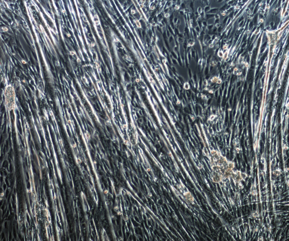
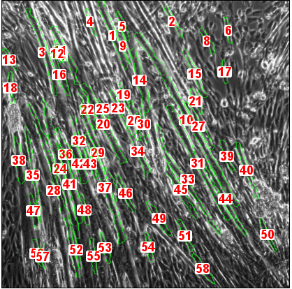

# TRUEFAD, TRUE Fiber Atrophy Distinction
| Video presentation |
|:-:|
|  |(https://youtu.be/CX9Syk-ChI0)

TRUEFAD is a composition of two FIJI/ImageJ macros designed for the analysis of two-dimensional images of muscle cells: TRUEFAD-Histo and TRUEFAD-Cells. TRUEFAD provides morpholigical metrics for phase contrast images of both myotubes (TRUEFAD-Cells) and laminin (TRUEFAD-Histo). 

TRUEFAD-Cells relies on a U-Net deep learning model trained with ZeroCostDL4Mic online [notebooks](https://github.com/HenriquesLab/ZeroCostDL4Mic/wiki). 

TRUEFAD-Histo is a non-deep learning tool with comparable results on laminin segmentation with state-of-the-art deep learning methods such as Cellpose.

## Installation

Requirements:
- Windows 10 (Linux interoperability seems to be failing due to latency issues)
- Up-to-date [FIJI/ImageJ2](https://imagej.net/software/fiji/downloads)
- The following FIJI plugins:
  - CSBDeep
  - DeepImageJ
  - MorphoLibJ
  - ReadAndWriteExcel 
  
To install the previous FIJI plugins, do:
- Select *Help>Update...*.
- Select *Manage update sites*.
- Tick *CSBDeep*, *DeepImageJ*, *IJPB-plugins* and *ResultsToExcel*.
- Select *Close*
- Select *Apply Changes*, wait for the install to finish and **restart FIJI/ImageJ**.

You can now download TRUEFAD by clicking on this [link](https://github.com/AurBrun/TRUEFAD/archive/refs/heads/main.zip) (or by clicking on the green button above named "*<> Code*" and then on *Download ZIP* or by using git and the following command: `git clone https://github.com/AurBrun/TRUEFAD.git`). Unzip the .ZIP file to your favorite location.

To use TRUEFAD-Cells, the trained deep learning model must be installed in DeepImageJ. The deep learning model is named `TRUEFAD Myotube detection.zip` in the folder you just unziped. To install the deep learning model you must then:
- Open DeepImageJ installation plugin in FIJI/Imagej: select *Plugins > DeepImageJ > DeepImageJ Install Model*.
- In the DeepImageJ interface, select *Private Model* tab.
- Tick *From ZIP file* and fill the blank with the path of the your `TRUEFAD Myotube detection.zip` model. For example: `D:\TRUEFAD\TRUEFAD Myotube detection.zip`.
- Tick the box stating that *I accept to install the model...* (we promise that our model is safe to install :blush:) and select *Install*.

## Usage
 *Temporary step-by-step procedure is only available for now before publication, video tutorials will be accessible by the end of the year*

### TRUEFAD-Cells 

Input image                |  TRUEFAD-Cells output
:-------------------------:|:-------------------------:
  |  

To start TRUEFAD-Cells, do:
- Drag and drop the `TRUEFAD-Cells DL - 06.09.23.ijm` file into FIJI. The FIJI macro editor should appear. 
- Click on the "Run" button.
- After the "Requirement" window, select your own properties for the image preprocessing and segmentation as well as the myotube retention parameters
- Select your first directory corresponding to your batch of images (you can go up to 1000 images)
- Select another directory for results export

You can try TRUEFAD-Cells on our example image located in the *TRUEFAD\example* folder. For this example, you can use the default parameter values. After execution, you should find an Excel sheet on your Desktop storing the TRUEFAD-Cells metrics. 

Be aware that TRUEFAD-Cells has been made for square images only so all input images will be automatically cropped to a square before treatment and the rest of the image will be ignored.

We recommend using grey scale 8-BIT images captured on positive phase contrast with x10 magnification of around 2000x2000 pixel resolution

### TRUEFAD-Histo

To start TRUEFAD-Histo, do:
- The first step is to create on your computer one folder for each fluorescence channel, depending on the type of analysis to be carried out (see choices below). For example, if laminin, BAF8 and SC71 fluorescence are going to be analyzed, you need 3 distinct folders containing the corresponding 8-BIT single channel image with exactly the same filename per original field (ex « sample1.tif » in folder laminin/dystrophin, « sample1.tif » in folder BAF8, and « sample1.tif » in folder SC71). Only 8-BIT image files to be analyzed should be found in folders. An additional empty folder must be created for result files. In the following procedure and current version of TRUEFAD, the default fluorescence is laminin for fiber segmentation, BAF8 for type I and SC71 for type IIA labeling respectively (other labeling depending on your protocol should be tested, and could be used instead). 
- Drag and drop the `TRUEFAD-Histo V1.6 - 30.10.23.ijm` file into FIJI. The FIJI macro editor should appear. 
- Click on the "Run" button. 
- Four options are available, depending on the objective of the analysis (see the main manuscript for further details) :
  •	« Import and work on label image » to work on a previously processed label map.
  •	« Segmentation of laminin image » to segment fibers using laminin (or other). In this case, only one folder is necessary. 
  •	« Type attribution Laminin+Type1+Type2A ». Includes segmentation + labeling of type I and type IIA fibers (as explained in the manuscript).
  •	« Type attribution Laminin+Type1+Type2A(+Type2X). Includes segmentation + fiber typing using 3 or 4 labeling in the same pipeline.
- You will get successively several windows to select the paths for the folders corresponding to each labeling (laminin, BAF8 and SC71 following the order specified in the name of the windows).
- Step 3: It is here possible to adjust the probability threshold to assign fiber to type I or IIA. We recommend keeping the default parameter but adjustments may be necessary depending on the quality of the image acquisition. Few images from a batch may be firstly checked manually using a different threshold and rerun TRUEFAD.
- Step 4: Different parameters can be adapted here to adjust the resulting segmentation, fiber retention, and results export
   •	"Boost Type I" or "Boost Type IIA": To increase artificially the signal contrast of the respective fluorescence channel
   •	"Artificially enhance edges": To use systematically the "Find edges" FIJI filter to artificially enhance laminin/dystrophin contrast
   •	"Directional median filter": Use MorpholibJ directional median filters to close laminin gaps and heterogeneity of fiber borders signal (more = more corrections and more artifacts)
   •	"Tolerance": Parameter used for watershed extended minima-based segmentation (see Morphological segmentation https://imagej.net/plugins/morpholibj)
   •	"Min/Max label area" "Label maximum elongation" "Label Erosion": These criteria define the label retention to obtain definitive muscle fiber
   •	"Manually edit label post filtering": This tickbox allows the user to switch from a fully automatic analysis to a semi-auto analysis with a GUI designed to help the user remove non desired label
   •	"Save automatically label map / ROIs"
   •  "Set scale (pix/µm)": Needs to be adapted to the image resolution to allow label filtering
   •  "Rate the performance of your machine": This highly subjective parameter creates artificial delays inversely proportionate to your grading of your machine's performance to let the time for Java and some plugins to load correctly in FIJI.
  • "Enable batch mode": Tick to let the plugin run in silent mode or untick to show each step of the image processing
### Macro should be starting ###
- At the end of the analysis, a few windows open, please click on « ok » for each.
- Results (TIF label map, Composite JPG image, ROI zip folder) could be found in the "Result" path previously selected by the user. A detailed quantified output could be found as an excel file "rename me after writing is done" saved on the computer desktop according to Read&WriteExcel plugin.
-We recommend checking all images for consistency in segmentation and fiber type identification. If not, rerun TRUEFAD with different settings.
  
## Deep learning model training

This section is addressed to developers who would like to get more details about our deep learning model training or who intend to reproduce the results presented in our publication. This section is thus not needed for users only.

The deep learning model has been trained using ZeroCostDL4Mic [notebooks](https://github.com/HenriquesLab/ZeroCostDL4Mic/wiki). We provide a copy of both our training/validation datasets and our deep learning model obtained with ZeroCostDL4Mic in our [release tagged 'data&model'](https://github.com/AurBrun/TRUEFAD/releases/tag/data%26model). As the notebooks may change on the ZeroCostDL4Mic website, we also provide in the `dev` folder the original `.ipynb` notebook we used to train our deep learning model. 

## Citation 

Publication under review ...

## Acknowledgments and Funding
