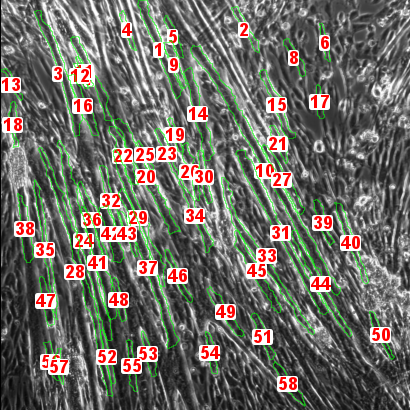

# TRUEFAD, TRUE Fiber Atrophy Distinction

TRUEFAD is a composition of two FIJI/ImageJ macros designed for the analysis of two-dimensional images of muscle cells: TRUEFAD-Histo and TRUEFAD-Cells. TRUEFAD provides morpholigical metrics for phase contrast images of both myotubes (TRUEFAD-Cells) and laminin (TRUEFAD-Histo). 

TRUEFAD-Cells relies on a U-Net deep learning model trained with ZeroCostDL4Mic online [notebooks](https://github.com/HenriquesLab/ZeroCostDL4Mic/wiki). 

TRUEFAD-Histo is a non-deep learning tool with comparable results on laminin segmentation with state-of-the-art deep learning methods such as Cellpose.

## Installation

Requirements:
- Windows 10 (Linux interoperability seems to be failing due to latency issues)
- Up-to-date [FIJI/ImageJ2](https://imagej.net/software/fiji/downloads)
- The following FIJI plugins:
  - CSBDeep
  - DeepImageJ
  - MorphoLibJ
  - ReadAndWriteExcel 
  
To install the previous FIJI plugins, do:
- Select *Help>Update...*.
- Select *Manage update sites*.
- Tick *CSBDeep*, *DeepImageJ*, *IJPB-plugins* and *ResultsToExcel*.
- Select *Close*
- Select *Apply Changes*, wait for the install to finish and **restart FIJI/ImageJ**.

You can now download TRUEFAD by clicking on this [link](https://github.com/AurBrun/TRUEFAD/archive/refs/heads/main.zip) (or by clicking on the green button above named "*<> Code*" and then on *Download ZIP* or by using git and the following command: `git clone https://github.com/AurBrun/TRUEFAD.git`). Unzip the .ZIP file to your favorite location.

To use TRUEFAD-Cells, the trained deep learning model must be installed in DeepImageJ. The deep learning model is named `TRUEFAD Myotube detection.zip` in the folder you just unziped. To install the deep learning model you must then:
- Open DeepImageJ installation plugin in FIJI/Imagej: select *Plugins > DeepImageJ > DeepImageJ Install Model*.
- In the DeepImageJ interface, select *Private Model* tab.
- Tick *From ZIP file* and fill the blank with the path of the your `TRUEFAD Myotube detection.zip` model. For example: `D:\TRUEFAD\TRUEFAD Myotube detection.zip`.
- Tick the box stating that *I accept to install the model...* (we promise that our model is safe to install :blush:) and select *Install*.

## Usage
 *Temporary step-by-step procedure is only available for now before publication, video tutorials will be accessible by the end of the year*

### TRUEFAD-Cells 

Input image                |  TRUEFAD-Cells output
:-------------------------:|:-------------------------:
  |  

To start TRUEFAD-Cells, do:
- Drag and drop the `TRUEFAD-Cells DL - 06.09.23.ijm` file into FIJI. The FIJI macro editor should appear. 
- Click on the "Run" button.
- After the "Requirement" window, select your own properties for the image preprocessing and segmentation as well as the myotube retention parameters
- Select your first directory corresponding to your batch of images (you can go up to 1000 images)
- Select another directory for results export

You can try TRUEFAD-Cells on our example image located in the *TRUEFAD\example* folder. For this example, you can use the default parameter values. After execution, you should find an Excel sheet on your Desktop storing the TRUEFAD-Cells metrics. 

Be aware that TRUEFAD-Cells has been made for square images only so all input images will be automatically cropped to a square before treatment and the rest of the image will be ignored.

We recommend using grey scale 8-BIT images captured on positive phase contrast with x10 magnification of around 2000x2000 pixel resolution

### TRUEFAD-Histo

To start TRUEFAD-Histo, do:
- Drag and drop the `TRUEFAD-Histo V1.5 - 06.09.23.ijm` file into FIJI. The FIJI macro editor should appear. 
- Click on the "Run" button. 

## Deep learning model training

This section is addressed to developers who would like to get more details about our deep learning model training or who intend to reproduce the results presented in our publication. This section is thus not needed for users only.

The deep learning model has been trained using ZeroCostDL4Mic [notebooks](https://github.com/HenriquesLab/ZeroCostDL4Mic/wiki). We provide a copy of both our training/validation datasets and our deep learning model obtained with ZeroCostDL4Mic in our [release tagged 'data&model'](https://github.com/AurBrun/TRUEFAD/releases/tag/data%26model). As the notebooks may change on the ZeroCostDL4Mic website, we also provide in the `dev` folder the original `.ipynb` notebook we used to train our deep learning model. 

## Citation 

Publication under review ...

## Acknowledgments and Funding
